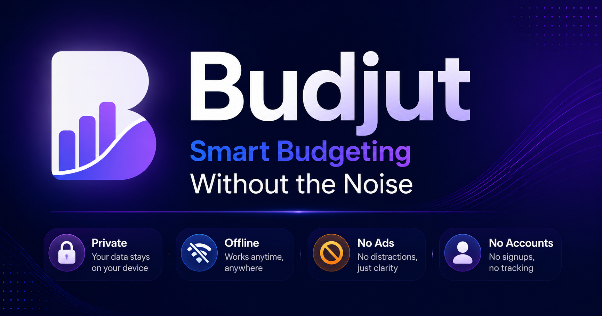

# 💸 Budjut – From Budgeting to Financial Progress



Budjut is a privacy-first personal finance and budgeting app that helps you track expenses, manage cash flow, build savings, eliminate debt, and measure financial progress. All without subscriptions, accounts, or tracking.

[](https://michaelsboost.com/Budjut/)   [](LICENSE)  [](https://github.com/michaelsboost/Budjut)  [](https://github.com/michaelsboost/Budjut/issues)

> Browser-based • Offline-friendly • Privacy-first • No accounts • No subscriptions

---

# 🌟 Overview

Budjut is a lightweight financial progress app that combines budgeting, expense tracking, savings goals, debt payoff planning, and wealth building tools into a single experience.

Unlike traditional budgeting software that focuses primarily on spending, Budjut emphasizes progress. Whether you're building an emergency fund, paying off debt, saving for a major purchase, or pursuing long-term financial independence, Budjut helps you understand not only where your money goes, but what it's helping you build.

### Core Components

* 💰 Income and expense tracking
* 📊 Cash-flow and spending analysis
* 🏦 Goal-based Vaults
* 🏛 Financial Foundation framework
* 🎯 Money Pattern Score
* 💡 Smart insights and coaching
* 📈 Reports and analytics
* 🔒 Local-first privacy

Everything stays on your device.

No cloud dependency. No accounts. No tracking.

---

# 🚀 Launch the App

### 🌐 Live Version

**https://michaelsboost.com/Budjut/**

### 📲 Progressive Web App (PWA)

Install Budjut to your home screen and use it offline anytime.

---

# 🧠 Philosophy

Most financial apps focus on transactions.

Budjut focuses on progress.

Tracking expenses is important, but financial health is built through intentional habits, purposeful saving, debt reduction, and long-term thinking.

Budjut is built around four principles:

* **Clarity** — understand your finances at a glance.
* **Ownership** — your data belongs to you.
* **Simplicity** — powerful tools without unnecessary complexity.
* **Progress** — measure what you're building, not merely what you're spending.

> “A budget is telling your money where to go instead of wondering where it went.”
>
> — Dave Ramsey

Budjut extends that idea:

> "Financial progress isn't measured by what you spend, but by what you're building."

---

# 🛠 Features

## 💰 Transaction Management

* Add, edit, and delete income and expense transactions
* Categorized entries with optional notes
* Real-time balance and cash-flow calculations

## 📊 Money Overview Dashboard

* Planned vs actual spending
* Budget left
* Cash left after expenses
* Spending flow visualization
* 50 / 30 / 20 snapshot

## 🏦 Vaults — Goal-Based Saving

Create dedicated vaults for:

| Examples             |
| -------------------- |
| 🚨 Emergency Fund    |
| 💳 Debt Snowball     |
| ✈️ Vacation          |
| 🚗 New Car           |
| 🏠 Home Down Payment |
| 🚀 Business Startup  |
| 🎄 Holiday Gifts     |
| 📦 Major Purchases   |

Vaults track:

* Goal amount
* Current balance
* Monthly contributions
* Progress percentage
* Estimated completion date
* Optional emoji/icon

> Vaults represent what you're building, not where your money went.

## 🏛 Financial Foundation

| Stage   | Objective                     |
| ------- | ----------------------------- |
| Stage 1 | Starter Emergency Fund        |
| Stage 2 | Eliminate High-Interest Debt  |
| Stage 3 | Build 3–12 Months of Expenses |
| Stage 4 | Long-Term Wealth Building     |

Each stage can be completed manually or automatically based on your financial data.

## 🎯 Money Pattern Score

Budjut evaluates nine dimensions of financial progress:

| Factor                        | Max Points |
| ----------------------------- | ---------: |
| Cash Flow Momentum            |         30 |
| Spending Control              |         25 |
| Savings Power                 |         20 |
| Budget Balance                |         15 |
| Category Discipline           |         10 |
| Emergency Fund Progress       |         15 |
| Debt Reduction Progress       |         15 |
| Goal Contributions            |         15 |
| Financial Foundation Progress |         15 |

Total: **160 points**, scaled to a score between **0–100**.

---

# 🧮 Money Pattern Score Ratings

|  Score | Rating         |
| -----: | -------------- |
| 90–100 | 🔥 Elite       |
|  75–89 | 💪 Strong      |
|  60–74 | 👍 Stable      |
|  40–59 | ⚠️ Needs Focus |
|   0–39 | 🚨 At Risk     |

Budjut also provides:

* Next Best Move recommendations
* Personalized insights
* Progress projections
* Smart coaching based on your habits

---

# 📈 Analytics & Reports

* Monthly spending trends
* Category breakdown charts
* Planned vs actual comparisons
* Visual progress indicators
* Trend analysis

---

# 💱 Multi-Currency Support

USD • EUR • GBP • JPY • CAD • AUD

---

# 📁 CSV Import & Export

Export transactions and import them again with validation.

### Example

```csv
amount,type,category,date,note
850,expense,Rent,2025-01-01,
100,expense,Electric,2025-01-05,
3000,income,Salary,2025-01-01,Monthly paycheck
```

| Column   | Type   | Description        |
| -------- | ------ | ------------------ |
| amount   | number | Transaction amount |
| type     | string | income or expense  |
| category | string | Category name      |
| date     | string | YYYY-MM-DD         |
| note     | string | Optional note      |

---

# 💾 Local Storage

* Automatic saving
* JSON backup and restore
* No accounts
* No servers
* No cloud dependency

---

# 🎮 Tips & Shortcuts

| Action                  | Method           |
| ----------------------- | ---------------- |
| New transaction         | Press `N`        |
| Search                  | Search field     |
| Filter type             | Dropdown         |
| Edit transaction        | ✏️ button        |
| Delete transaction      | 🗑️ button       |
| Create Vault            | Vault panel      |
| Toggle Foundation stage | Foundation panel |
| Share summary           | Share button     |

---

# 🎨 Modern Interface

* Responsive design
* Glassmorphism cards
* Dark mode
* Mobile friendly
* Smooth animations
* Coach-like experience

---

# 🔒 Privacy First

* Entirely client-side
* No analytics
* No tracking
* No external requests

**Your data stays on your device. Always.**

---

# ⚡ Getting Started

```sh
git clone https://github.com/michaelsboost/Budjut.git
cd Budjut
npm install
npm run serve
```

Open:

```sh
index.html
```

---

## **🤝 Contributing**

Want to contribute?

- Fork the repo
- Create a feature branch (`feature-budget-analytics`)
- Submit a pull request 🎉 and help improve financial accessibility 💸

---

## **📜 License**

Licensed under the **MIT License** — free to use, share, and remix.

**Developed by:** [Michael Schwartz](https://michaelsboost.com/)
**Maintained by:** The community

## **☕ Support the Developer**

If Budjut was helpful for you, consider supporting future projects:

- 🎨 Check out my Graphic Design Course: https://michaelsboost.com/graphicdesign
- 🛒 Register as a customer on my store: https://michaelsboost.com/store
- ☕ Buy me a coffee: http://ko-fi.com/michaelsboost
- 👕 Purchase a T-Shirt: https://michaelsboost.com/gear
- 🖼️ Buy my art prints: https://deviantart.com/michaelsboost/prints
- 💰 Donate via PayPal: https://michaelsboost.com/donate
- 💵 Donate via Cash App: https://cash.me/$michaelsboost

Your support helps fund future open-source projects and tools for the community 🚀